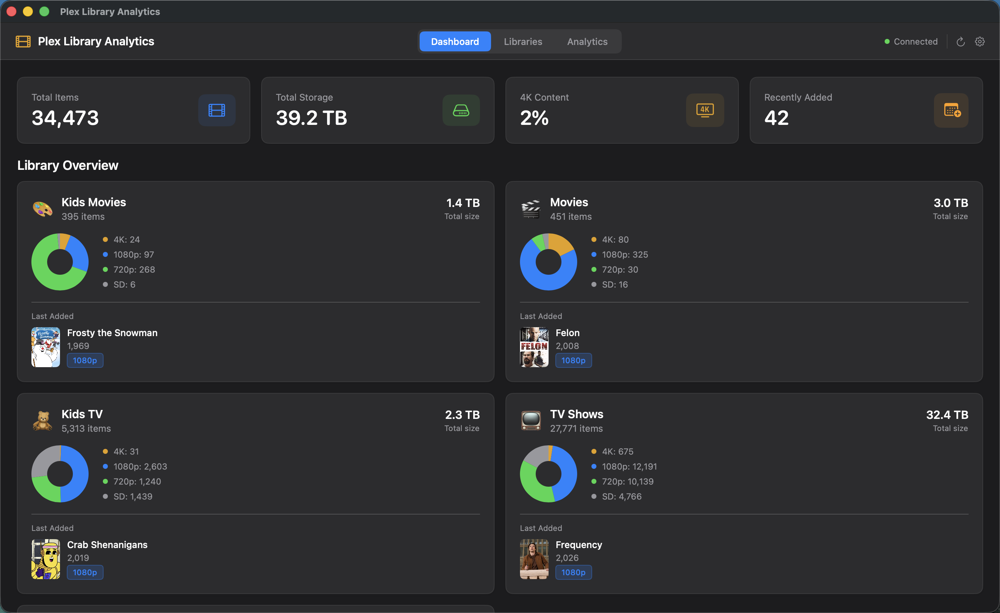
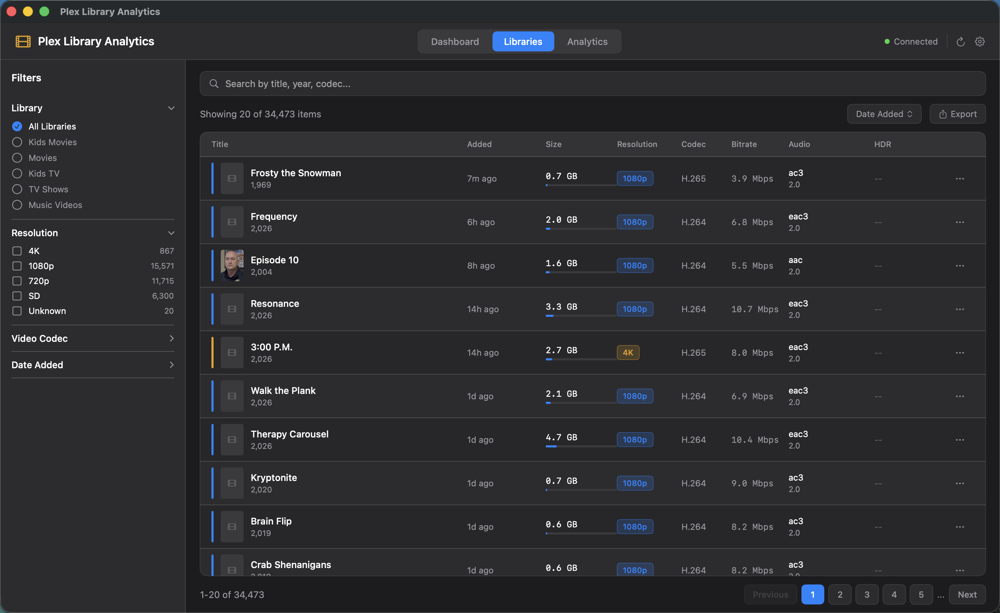
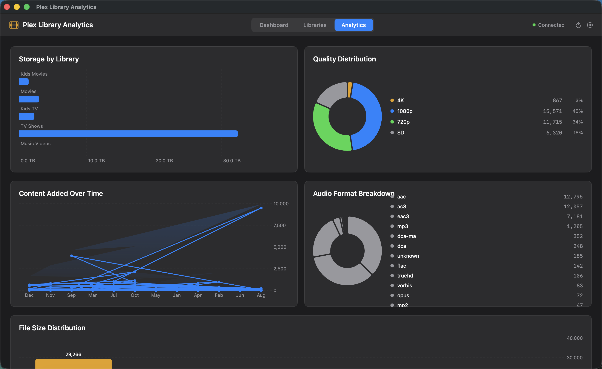
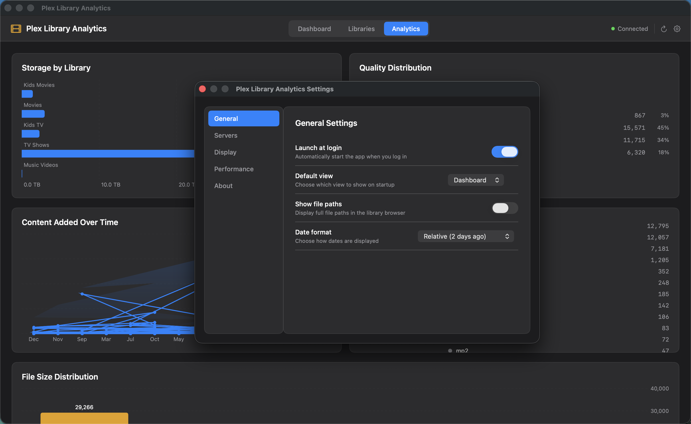

<div align="center">
  

  # Plex Library Analytics

  **A native macOS app that transforms your Plex Media Server into a full analytics dashboard.**

  [](https://www.apple.com/macos/sonoma/)
  [](https://swift.org/)
  [](https://developer.apple.com/xcode/swiftui/)
  [](https://developer.apple.com/documentation/charts)
  [](LICENSE)
  [](https://github.com/bytePatrol/PlexMediaAnalytics/releases/latest)

  
</div>

---

Plex Library Analytics connects directly to your Plex Media Server and gives you a complete, visual picture of your entire media collection. Know exactly how much storage each library consumes, which codecs dominate your collection, how your library has grown year over year, and drill into the technical specs of every single file — all in a beautiful dark-themed native macOS app with zero third-party dependencies.

## Features

### Dashboard
Everything you need to know about your library, at a glance.

- **Live stat cards** — total item count, total storage used, percentage of 4K content, and recently added count, all pulled live from your server
- **Per-library overview cards** — each library shows its item count, total size, and a color-coded mini pie chart of resolution distribution (4K / 1080p / 720p / SD), plus the most recently added title with its poster thumbnail
- **Connection status indicator** — a persistent live indicator confirms your server is reachable at all times

### Library Browser
Explore every item in your library with powerful search, filtering, and sorting.

- **Full media table** — browse across all libraries in a paginated table with columns for title, date added, file size, resolution, codec, bitrate, audio format, and HDR status
- **Live full-text search** — filter by title, year, codec, or any metadata field instantly as you type
- **Filter sidebar** — narrow results by library, resolution tier, video codec, and date added range
- **Multi-column sorting** — sort ascending or descending by any column
- **Pagination** — 20 items per page with fast navigation across libraries of 34,000+ items
- **Media detail sheet** — double-click any row to open a rich detail panel with the full poster image, complete stream information (video, audio, subtitle tracks), and file metadata
- **CSV export** — export the current filtered and sorted view to a spreadsheet in one click

### Analytics
Five interactive Swift Charts charts give you an honest picture of your library composition.

- **Storage by Library** — horizontal bar chart showing exactly how many terabytes each library consumes side by side
- **Quality Distribution** — donut chart breaking down the percentage of 4K, 1080p, 720p, and SD content across your entire collection
- **Content Added Over Time** — combined line and area chart plotting exactly how your library has grown, month by month
- **Audio Format Breakdown** — donut chart cataloguing every audio codec present (AAC, AC3, EAC3, DCA, TrueHD, DTS-X, Atmos, Opus, and more)
- **File Size Distribution** — histogram of per-file sizes across your collection, making outliers immediately obvious
- **Summary stat boxes** — average bitrate, average file size, total HDR item count, and aggregate library duration

### Settings
Tune the app to your workflow without touching a config file.

- **General** — set the default startup tab, toggle relative vs. absolute date formatting, show or hide full file paths
- **Servers** — add, edit, remove, and test multiple Plex server connections; toggle HTTPS per server
- **Display** — UI density and appearance preferences
- **Performance** — control request batch sizes and auto-refresh intervals (5 min · 15 min · 30 min · 1 hr)

### Security & Privacy
- Authentication tokens are stored exclusively in the **macOS Keychain** — never written to disk in plain text
- Full support for **self-signed SSL certificates** on local Plex servers — no workarounds needed
- **Zero telemetry** — no analytics, no crash reporting SDKs, no network calls beyond your own Plex server
- **Read-only** — the app never writes to or modifies your Plex library or metadata

---

## Screenshots

| Dashboard | Library Browser |
|:---------:|:---------------:|
|  |  |

| Analytics | Settings |
|:---------:|:--------:|
|  |  |

---

## Installation

### Download — Recommended

1. Go to the [**Latest Release**](https://github.com/bytePatrol/PlexMediaAnalytics/releases/latest)
2. Download **`Plex Library Analytics.dmg`**
3. Open the DMG and drag **Plex Library Analytics.app** to your **Applications** folder
4. Launch the app and connect your server

> **First launch:** macOS may show a Gatekeeper warning because the app is not notarized. Right-click the app icon → **Open** → **Open** to allow it.

### Connect Your Server

1. Click **Add Server** on the welcome screen
2. Enter your Plex server's **hostname or IP address** and **port** (default: `32400`)
3. Enable **Secure (HTTPS)** if your server uses TLS — self-signed certificates are supported automatically
4. Paste your **Plex Token** — find it in Plex Web under *Settings → Account*, or in any Plex API URL as `X-Plex-Token`
5. Click **Test Connection** to verify, then **Save**

Your libraries will begin loading immediately.

---

## Build from Source

### Requirements

| Dependency | Version |
|-----------|---------|
| macOS | 14.0 Sonoma or later |
| Xcode | 15.4 or later |
| Swift | 5.0 |
| XcodeGen | 2.x — `brew install xcodegen` |

### Steps

```bash
# 1. Clone the repository
git clone https://github.com/bytePatrol/PlexMediaAnalytics.git
cd PlexMediaAnalytics

# 2. Generate the Xcode project
xcodegen generate

# 3. Build (Release)
xcodebuild \
  -project "Plex Library Analytics.xcodeproj" \
  -scheme "Plex Library Analytics" \
  -configuration Release \
  -derivedDataPath build \
  build

# 4. Install to Applications
rm -rf "/Applications/Plex Library Analytics.app"
ditto "build/Build/Products/Release/Plex Library Analytics.app" \
      "/Applications/Plex Library Analytics.app"

open "/Applications/Plex Library Analytics.app"
```

Or open in Xcode and press **⌘R** to build and run directly.

---

## Architecture

The project follows **MVVM with a Repository pattern**, driven by Combine publishers and SwiftUI's environment system.

```
Plex Library Analytics/
├── App/
│   ├── PlexLibraryAnalyticsApp.swift   # @main entry point
│   └── ContentView.swift               # Root view, tab navigation
├── Models/
│   ├── MediaItem.swift                 # Core media metadata model
│   ├── PlexLibrary.swift               # Library model
│   └── PlexServer.swift                # Server model with Keychain integration
├── Services/
│   ├── PlexAPIClient.swift             # REST API client (async/await + Codable)
│   ├── PlexRepository.swift            # Data layer with Combine publishers
│   ├── MockDataProvider.swift          # Sample data for offline preview
│   ├── KeychainManager.swift           # Secure token storage (SecItem APIs)
│   └── PlexOAuthService.swift          # PIN-based OAuth flow
├── ViewModels/
│   ├── AppState.swift                  # Shared @EnvironmentObject
│   ├── DashboardViewModel.swift
│   ├── LibraryViewModel.swift
│   └── AnalyticsViewModel.swift
├── Views/
│   ├── Dashboard/                      # Stat cards, library cards, welcome banner
│   ├── Library/                        # Browser table, filter sidebar, detail sheet
│   ├── Analytics/                      # All Swift Charts visualizations
│   ├── Settings/                       # Tabbed settings panel
│   ├── Onboarding/                     # Server setup flow
│   └── Components/                     # MiniPieChart, QualityBadge, shared components
└── Utilities/
    ├── Theme.swift                     # PlexTheme design tokens + view modifiers
    └── Formatters.swift                # Date, file size, and bitrate formatters
```

**Notable implementation details:**

- All Plex API calls use `async/await`; Combine publishers propagate results to ViewModels
- `PlexTrustDelegate` implements `URLSessionDelegate` to accept self-signed TLS certificates on local servers
- TV Show libraries request episode-level metadata with `type=4` appended to the `/library/sections/{key}/all` endpoint, since show-level responses contain no `Media` stream objects
- Thumbnail loading is triggered from `onAppear` directly on each `MediaTableRow` rather than delegated to a child view, ensuring reliable firing inside `LazyVStack`
- No third-party dependencies — Swift Charts, Combine, and URLSession handle everything

---

## Requirements

| Requirement | Minimum |
|-------------|---------|
| macOS | 14.0 Sonoma |
| Plex Media Server | Any recent version |
| Network | Local or remote access to your Plex server |

---

## License

[MIT License](LICENSE) — use it, fork it, ship it.

---

<div align="center">

Built for Plex power users who want real numbers, not just a pretty grid.

</div>
